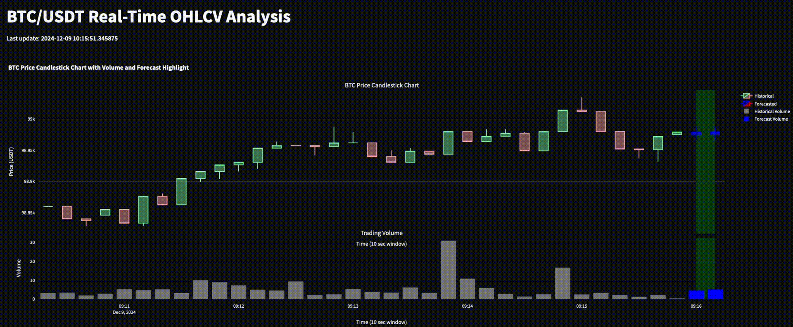

# Real-Time Finance Asset Scraper & Forecaster

This project provides a real-time pipeline to scrape and forecast financial asset prices using the Binance API. It focuses on Bitcoin (BTC/USDT) but is designed to be adaptable for other trading pairs. The pipeline retrieves raw trading data, processes it into OHLCV (Open-High-Low-Close-Volume) format, and performs price forecasting. A dynamic web app visualizes both historical data and predictions.



---

## Features
- **Real-Time Data Collection**: Fetch live BTC/USDT trade data using Binance API.
- **Data Transformation**: Convert raw trade data into OHLCV format using pandas or Pathway.
- **Forecasting**: Predict future OHLCV prices using ARIMA or other machine learning models (e.g., LSTMs).
- **Visualization**: Real-time candlestick charts with historical and forecasted data on a shared plot, including forecast zone highlighting.
- **Performance Comparison**: Evaluate the efficiency and scalability of pandas vs. Pathway for OHLCV data transformation.

---

## Pipeline Overview


1. **Data Retrieval**:

   - The Binance API fetches recent trade data (price, quantity, timestamp, etc.) for the BTC/USDT trading pair.

   - The raw data includes attributes like transaction ID, price, quantity, and timestamp.

2. **Data Transformation**:
   - **Pandas Approach**:
     - Raw trade data is grouped into 1-minute time windows.
     - OHLCV metrics are computed:
       - **Open**: First trade price in the window.
       - **High**: Maximum trade price in the window.
       - **Low**: Minimum trade price in the window.
       - **Close**: Last trade price in the window.
       - **Volume**: Sum of quantities traded in the window.
   - **Pathway Approach**:
     - Similar transformation pipeline as pandas but optimized for scalability and real-time processing.

3. **Forecasting**:
   - The ARIMA model predicts future OHLCV values.
   - Forecasting output includes predicted open, high, low, close, and volume metrics for each future time window.

4. **Visualization**:
   - Streamlit is used to create a web app that dynamically refreshes.
   - The app displays:
     - A candlestick chart with historical and forecasted OHLCV data.
     - Trading volume in a synchronized subplot.
     - A highlighted zone indicating forecasted time periods.

---

## Prerequisites
Ensure you have the following installed:
- Python ≥ 3.7
- Pip package manager

Install the required Python libraries:
```bash
pip install -r requirements.txt
```

## Installation

Clone the repository :

```bash
git clone https://github.com/your_username/realtime-asset-forecasting.git
cd realtime-asset-forecasting
```

## Set Up Binance API Keys

1. Log in to your Binance account.
2. Generate an API key and secret (refer to Binance's official guide).
3. Create a .env file in the project root and add your keys.


## How to Run It Locally
In two different terminals, proceed as follow:

1. Run data retrieval
```bash
python -m src.data_retrieval
```

2. Run Streamlit Web App:
```bash
streamlit run src/app.py
```

## Performance Comparison: Pandas vs. Pathway

This project implements two distinct approaches to data transformation:

- Pandas:
    1. Suitable for smaller datasets and prototyping.
    2. Transformation involves grouping and aggregation using pandas groupby().

- Pathway:
    1. Optimized for real-time and large-scale data processing.
    2. Uses Pathway’s table operations and reducers for fast aggregation.
    3. Enables live updating for high-frequency trading data.

Both approaches are implemented to allow side-by-side performance evaluation.

## Future Enhancements

- Enhance the scraping/transform pipeline
- Extend forecasting models (Prophet, etc)
- Incorporate live performance metrics for pandas and Pathway.
- Deploy the web app Kubernetes